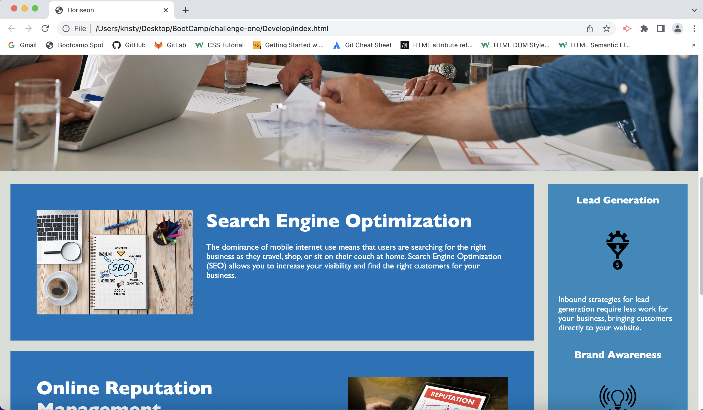
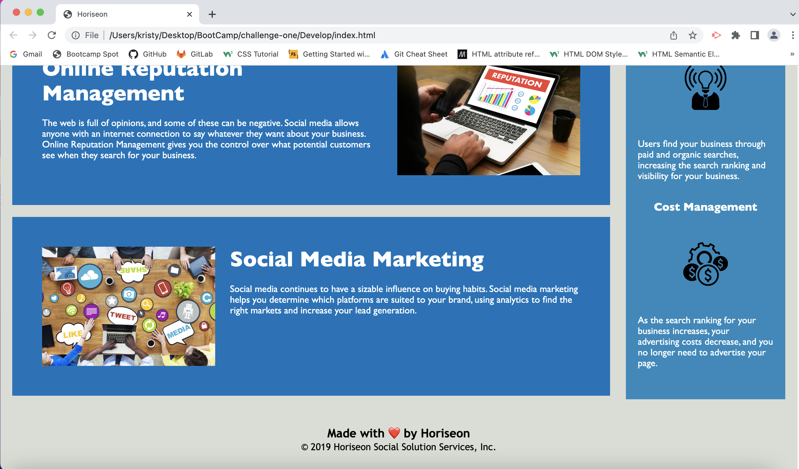

# Challenge One: Refactor Starter Code for Horiseon

## For this challenge, I worked to refactor the starter code for the Horiseon website. I refactored the code to make it more accessible for users and to optimize the site on search engines. I made many changes to improve upon the starter code. My main motivation was to make the site easier for users with accessibility needs. My other goal was to meet the needs of the Horiseon marketing agency, which were to optimize the site for search engines. By cleaning up the starter code, adding in semantic HTML elements, adding alt attributes to image elements, adding a better title, and condensing some of the repeated code, I was able to both accomplish my goal of accessibility and meet the needs of Horiseon's marketing agency. 

### This link will take you to the refactored site: 

[See deployed site here](https://kristynerhaugen.github.io/code-refactor/)

### These three images show the refactored site. Although it looks the same as the starter code, the functionality has changed. 

#### 
#### 
#### 

## Installation
### Access refactored code via GitHub. Install how you would usually install from a GitHub repository. 

## Usage
### This refactored code now works in a more accessible way. For example, the added alt attributes for images will allow screen readers to describe the images. Additionally, the semantic HTML elements will also improve the site's functionality with screen readers. This changes also optimize the site for search engines because search engines increase traffic flow to site with improved accessibility features. 

## Credits
### The starter code for this site was provided by Horiseon's marking agency. The modifications I made to it were as a result of information I learned in the BootCamp Spot modules and information I learned in BootCamp classes. I also referred to W3 School to better understand HTML semantic Elements (https://www.w3schools.com/html/html5_semantic_elements.asp). 

## License 
### n/a 